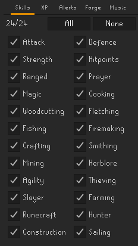
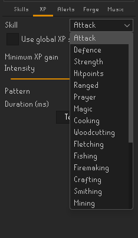
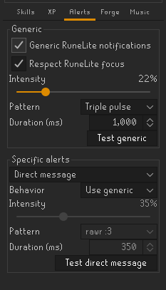
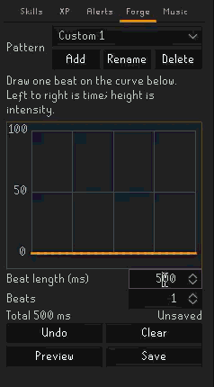
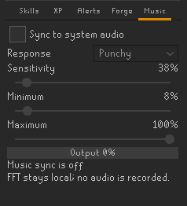

# HapticScape

HapticScape is an unofficial RuneLite-based client that converts Old School
RuneScape events and Windows system audio into configurable haptic feedback. It
connects to devices through [Intiface Central](https://intiface.com/) and also
provides optional local click feedback and encrypted remote sessions between
two HapticScape clients.

Prebuilt releases currently target Windows 10 and newer.

> [!IMPORTANT]
> HapticScape is distributed as a custom RuneLite build. It is not an official
> RuneLite client or Plugin Hub plugin, and it is not endorsed by Jagex,
> RuneLite, Intiface, or any device manufacturer. See
> [Important notices](#important-notices) before using it.

## Install on Windows

### What you need

- Windows 10 or newer.
- The [official RuneLite launcher](https://runelite.net/) installed. HapticScape
  uses its bundled Java runtime but does not modify the RuneLite installation.
- [Intiface Central](https://intiface.com/) installed.
- A device supported by Intiface and the Bluetooth, USB, serial, or network
  connection required by that device.

### 1. Download and extract HapticScape

1. Open [HapticScape Releases](https://github.com/ashy0019/HapticScape/releases).
2. Open the newest stable release.
3. Under **Assets**, download the Windows ZIP named like
   `HapticScape-Windows-x64-X.Y.Z.zip`.
4. Do not download GitHub's automatically generated **Source code** archives
   unless you intend to build the project yourself.
5. Right-click the downloaded ZIP and select **Extract All**.
6. Open the extracted `HapticScape` folder.
7. Run `HapticScape.exe`.

Keep `HapticScape.exe` beside its `app` folder. The executable will not work by
itself if it is moved out of the extracted folder.

Running `HapticScape.exe` also registers the `hapticscape://` link handler for
the current Windows account. This lets an accepted Discord Remote Play request
start or focus the packaged client. It does not grant remote control.

Windows may show a SmartScreen warning because HapticScape releases are not
code-signed. Only run a copy obtained from a source you trust. Each release also
provides a `.zip.sha256` file so the download can be checked before extraction.
The checksum detects corruption or a mismatched download, but it is not an
independent publisher signature.

To verify the ZIP in PowerShell, replace `X.Y.Z` with the downloaded version:

```powershell
Get-FileHash ".\HapticScape-Windows-x64-X.Y.Z.zip" -Algorithm SHA256
```

The displayed hash must match the value inside the downloaded `.zip.sha256`
file.

### 2. Connect a device

1. Open Intiface Central.
2. Start the Intiface engine or server.
3. Scan for your device in Intiface Central and connect it.
4. Use Intiface's own controls to confirm that the device responds.
5. Start `HapticScape.exe`.
6. Open the HapticScape side panel in RuneLite.
7. Leave the Intiface address at `ws://localhost:12345` unless Intiface uses a
   different computer or port.
8. Select **Connect**.
9. Select **Test pattern** and begin with a low intensity and short duration.

Some devices ignore very low intensity values. If the device appears in the
panel but does not move, increase the intensity gradually.

### Jagex Accounts

A custom RuneLite development client cannot receive a Jagex Account session
from the Jagex Launcher in the same way as the official client. Follow
RuneLite's official
[Using Jagex Accounts development guide](https://github.com/runelite/runelite/wiki/Using-Jagex-Accounts)
if HapticScape opens without your account session.

In summary:

1. Confirm that the official RuneLite launcher is version 2.6.3 or newer.
2. Open **RuneLite (configure)** from the Windows Start menu.
3. Add `--insecure-write-credentials` to **Client arguments** and save.
4. Launch RuneLite through the Jagex Launcher once.
5. Close RuneLite and start HapticScape.

The setup creates `.runelite/credentials.properties`. That file can provide
access to the account that created it without requiring the account password.
Never commit, upload, package, or send it to another person. If it is exposed,
use **End sessions** in the Jagex Account settings to invalidate it.

### Updates

The Windows launcher can check stable HapticScape releases before RuneLite
starts. Automatic installation and update notifications are separate settings
in the HapticScape panel.

- Keep the complete HapticScape folder in a writable location.
- Do not install it in a folder that requires administrator permission for
  every change.
- The updater verifies the release ZIP against its published SHA-256 checksum.
- If an update cannot be installed, the launcher restores the previous bundle.
- Disabling automatic installation and notifications prevents automatic startup
  checks. Selecting **Check now** still requests release information from
  GitHub.

## Screenshots

<table align="center">
  <tr>
    <td align="center" valign="top" bgcolor="#212121"><a href="docs/images/hapticscape-skills.png"></a></td>
    <td align="center" valign="top" bgcolor="#212121"><a href="docs/images/hapticscape-xp-profiles.png"></a></td>
    <td align="center" valign="top" bgcolor="#212121"><a href="docs/images/hapticscape-alerts.png"></a></td>
  </tr>
  <tr>
    <td colspan="2" align="center" valign="top" bgcolor="#212121"><a href="docs/images/hapticscape-pattern-forge.gif"></a></td>
    <td align="center" valign="top" bgcolor="#212121"><a href="docs/images/hapticscape-music.png"></a></td>
  </tr>
</table>

## Features

### Intiface connection and device control

- Connect to an Intiface WebSocket server without restarting RuneLite.
- Discover connected devices and identify whether they support vibration.
- Send feedback to all discovered devices with compatible vibration actuators.
- Test configured patterns from the HapticScape panel.
- Recover when Intiface stops or the WebSocket connection is lost.
- Reconnect after restarting Intiface without relaunching HapticScape.
- Stop all connected devices immediately with **Stop now**.

HapticScape uses the Buttplug protocol directly through RuneLite's existing
HTTP and JSON dependencies. It does not require an additional Buttplug Java
library at runtime.

### XP and skill feedback

- Trigger feedback when one XP gain reaches a configurable threshold.
- Enable or disable haptic and click feedback separately for each skill.
- Use global intensity, duration, and pattern settings.
- Override the global haptic settings for individual skills.
- Configure separate feedback for ordinary level increases.
- Configure dedicated feedback for level milestones.
- Preview global, level, milestone, and per-skill settings from the panel.

### Built-in haptic patterns and playback scheduling

The built-in patterns are:

- Single
- Double
- Triple
- Ascending
- Descending

Intensity can be set from 0% to 100%. Built-in pattern duration can be set from
50 milliseconds to 10 seconds.

HapticScape assigns priorities to simultaneous events. Urgent alerts can
interrupt routine feedback, repeated queued events are combined, stale queued
feedback is discarded, and continuous Music sync resumes after a finite pattern
finishes.

### RuneLite notifications and semantic alerts

HapticScape can use a Generic profile for ordinary RuneLite notifications and
separate profiles for these recognized events:

- Direct messages
- Trade requests
- Low hitpoints
- Low prayer
- Valuable drops
- Full inventory
- Poison or venom
- Special attack ready
- Player death

Each specific alert can be disabled, inherit the Generic profile, or use its
own pattern, intensity, and duration. Low hitpoints, low prayer, valuable drops,
and special attack readiness also have configurable trigger thresholds.

When a specific event and a generic RuneLite notification describe the same
occurrence, HapticScape prioritizes the specific alert to avoid duplicate
feedback. Generic notification feedback can also follow RuneLite's focused
window behavior.

### Custom Pattern Forge

Pattern Forge creates reusable haptic patterns inside the side panel.

- Draw an intensity curve with the mouse.
- Set one beat from 50 milliseconds to 10 seconds.
- Repeat the beat from 1 to 72 times.
- Undo changes, clear the curve, preview the result, and save it.
- Add, rename, and delete up to 100 custom patterns.
- Assign custom patterns to XP feedback, skill profiles, alerts, milestones,
  previews, and remote haptic actions.

A custom pattern stores its own curve, beat duration, and repetition count.
Renaming a pattern preserves its assignments. Deleting a pattern returns its
existing assignments to the Single built-in pattern.

When a custom pattern is assigned to a local XP or alert profile, it uses its
saved intensity curve, timing, and repetitions instead of the surrounding
profile's built-in intensity and duration values. A Live Remote action scales
the selected custom curve to the requested remote intensity and duration.

### Music sync

Music sync is available on Windows. It converts the current Windows audio
output into continuous haptic feedback using local WASAPI loopback capture and
FFT analysis.

- Choose Smooth, Rhythmic, or Punchy response behavior.
- Adjust analyzer sensitivity.
- Set independent minimum and maximum haptic output levels.
- View the mapped output on a live meter.
- Scale output with the Windows master volume and mute state.
- Allow finite XP, alert, preview, remote patterns, and Remote Live Forge to
  interrupt Music sync.
- Resume Music sync automatically after the interrupting pattern ends.

Music sync listens to the complete output mix of the selected Windows audio
device. Audio from other applications using that device can affect the haptic
output.

### Audio clicker

The clicker provides local audio feedback independently of Intiface and haptic
devices.

- Set click volume from 0% to 100%.
- Select which skills can produce XP clicks.
- Set a separate XP threshold for clicks.
- Enable clicks for level increases and milestones.
- Enable clicks for selected semantic alerts and generic notifications.
- Create up to 50 phrase rules using Contains, Exact, or Java regular
  expression matching.
- Test click playback directly from the panel.

Phrase rules inspect RuneLite chat messages locally. Contains and Exact matches
ignore case. Regular expression rules use Java regular expression syntax.

### Remote Control

Remote Control creates an explicit session between a controller and a
participant. Both people run HapticScape. The clients exchange encrypted data
through a WebSocket relay and never connect directly to one another.

Remote Control uses this hosted Cloudflare relay by default:

```text
wss://hapticscape-remote-relay.hapticscape.workers.dev/relay
```

The relay field remains editable for users who prefer a self-hosted service.
This repository includes the Cloudflare Worker and Durable Object relay
implementation under [`remote-relay`](remote-relay).

#### Start a session

1. Both people should use the same current HapticScape release.
2. The controller selects **Create & copy code**. Relay configuration is
   available under **Advanced** when needed.
3. The controller sends the temporary connection code to the participant
   through a private channel.
4. The participant selects **Paste & join**, reviews the confirmation, and
   accepts the session.
5. The participant's current HapticScape settings load into the controller's
   panel.

A connection code is a 256-bit random bearer secret. It retrieves an
independently encrypted invitation from a one-use relay mailbox that expires
after five minutes. Anyone who obtains an unexpired code may be able to join
that session, so connection codes must be treated as secrets.

Legacy direct invitations remain accepted as a fallback when the temporary
pairing service is unavailable.

#### Optional Discord pairing

The hosted relay also provides a user-installed Discord companion. It replaces
copying a connection code with an Accept or Deny request in a one-to-one DM.
Both people still use HapticScape, and the participant must approve the normal
local consent prompt before any session begins.

1. Each person selects **Install Discord app** in Remote Play and adds it to
   their Discord account.
2. Each person runs `/hapticscape link` and pastes their private `HSL1` code
   into **Remote Play → Discord** once.
3. Both linked clients should use the same release. The controller's client
   must be running when the request is created.
4. In a one-to-one DM with the participant, the controller runs
   `/hapticscape connect`.
5. Discord displays **Accept** and **Deny** buttons for that participant.
6. **Accept** opens HapticScape or brings the running Windows client forward,
   then opens Remote Play.
7. The participant reviews the local HapticScape consent dialog and accepts or
   declines the session there.

Discord approval does not grant remote control. The Accept link contains an
opaque, short-lived request token but no session key or connection code. The
relay accepts it only from the HapticScape installation linked to the intended
participant's Discord account. The controller creates the encrypted one-use
invitation only afterward. Its `HSP1` bearer code is encrypted to an ephemeral
key generated by the participant client before it crosses the linked client
channel, so Discord and the relay receive ciphertext rather than that code.

The automatic launch requires the packaged Windows client. Running
`HapticScape.exe` registers the `hapticscape://` handler for the current Windows
account. Source builds launched through Gradle can still use the manual
**Create & copy code** and **Paste & join** flow.

`/hapticscape connect` works only in a one-to-one DM, not a server channel or
group DM. Manual connection codes remain available as a fallback.

`/hapticscape status` reports whether the linked client is online.
`/hapticscape unlink` removes the link. The same link can also be removed from
the Remote Play panel.

Self-hosted relay operators must create and configure their own Discord
application. See [`remote-relay/README.md`](remote-relay/README.md) for the
deployment, command-registration, and privacy details.

#### Remote settings

When the participant allows remote settings changes:

- The synchronized profile includes XP, skill, alert, custom pattern, Music
  sync, click, and phrase-rule settings.
- The controller edits the participant's displayed HapticScape settings.
- Accepted changes are saved on the participant's computer as they are made.
- The controller's own local profile is not overwritten.
- The final participant settings remain after the session ends.
- Settings updates and acknowledgements are retried when a relay frame is lost.

The participant's Intiface address, connection state, remote permissions,
Emergency Off control, and session controls are never included in the remotely
editable settings.

#### Live remote actions

The controller can request actions that the participant has allowed:

- Play a built-in or participant-saved custom haptic pattern.
- Set requested haptic intensity and duration within participant-owned limits.
- Stop remote haptic output.
- Play the participant's local click sound.
- Show a local RuneLite desktop notification.
- Show a clearly labeled local HapticScape notice in the RuneLite chatbox.

Remote chatbox notices use RuneLite's local console-message path. They do not
type, submit, or transmit public, private, clan, or friends chat to the game
server.

Remote actions have unique identifiers, three-second expiration, duplicate
protection, validation, rate limits, and delivery acknowledgements. The
participant's client enforces the permissions and limits even if the controller
requests a value outside them.

#### Remote Live Forge

When the participant separately enables Live Forge control, the controller can
draw continuous haptic output on a moving timeline.

- Holding and moving vertically inside the graph controls current intensity.
- The graph retains a short visual history of the current gesture.
- Encrypted intensity samples are sent 20 times per second.
- The participant's maximum remote intensity is enforced on every sample.
- Releasing the mouse fades output to zero over 300 milliseconds.
- A participant-owned maximum hold duration ends overly long gestures.
- Missing samples automatically trigger a receiver-side release after roughly
  350 milliseconds.
- Emergency Off, session end, connection loss, and plugin shutdown stop the
  live output immediately.
- Music sync resumes after Live Forge releases the haptic channel.

Live Forge gestures are temporary. They are not added to the participant's
saved custom pattern library.

#### Participant permissions and safety controls

Only the participant can change:

- Permission to change HapticScape settings.
- Permission to request haptic actions.
- Permission to use continuous Live Forge control.
- Permission to play click sounds.
- Permission to display desktop notifications.
- Permission to display local chatbox notices.
- Maximum remote haptic intensity.
- Maximum remote haptic duration.
- Maximum duration of one Live Forge gesture.

Local chatbox notices and Live Forge control are disabled by default. The
default maximum remote intensity is 60%, the default maximum remote action
duration is 3 seconds, and the default maximum Live Forge hold is 30 seconds.

The participant always retains these local controls:

- **Emergency Off**, which stops output and rejects new remote actions.
- **Resume**, which permits new allowed actions without replaying rejected ones.
- **End session**.
- Intiface connection and device controls.

Connection loss and session shutdown stop accepted remote output and clear
pending remote action state.

#### Post-session settings lock

The controller can propose that the participant keep the final feedback
settings locked after the session.

- HapticScape generates the unlock key on the controller's computer.
- The participant must explicitly accept the proposal.
- A declined, cancelled, or failed proposal does not create a lock.
- If accepted, the lock remains after either person ends the session.
- Pattern Forge and Music sync remain locally editable after the session.
- Emergency Off, End session, and Intiface controls remain available.

The post-session lock is a local application control. It is not a tamper-proof
security boundary, and local developer recovery can remove it.

On Windows, the controller can retain keys for accepted locks in **Saved Unlock
Keys**. Saved keys are protected with Windows DPAPI for the current Windows
account. Entries can be labeled, annotated, copied when needed, and deleted.
Invitation keys and ordinary session encryption keys are not saved in this
vault.

### Windows client updates

- Check stable GitHub Releases automatically or manually.
- Install updates automatically, request confirmation, or notify without
  installing.
- Skip one specific version without disabling future update offers.
- Verify downloaded bundles with the published SHA-256 checksum.
- Validate a staged bundle before replacing the installed version.
- Restore the previous bundle if installation fails.
- Launch the installed client when GitHub cannot be reached.

Draft and prerelease GitHub releases are not offered through the stable update
channel.

## Panel guide

| Area | Purpose |
| --- | --- |
| **Feedback** | Global XP settings, level feedback, milestone feedback, and previews. |
| **Skills** | Separate per-skill enablement for haptics and clicks. |
| **XP** | Per-skill haptic profiles that inherit or override global settings. |
| **Alerts** | Generic RuneLite notification behavior and specific gameplay alert profiles. |
| **Forge** | Custom pattern drawing, timing, preview, and library management. |
| **Music** | Windows audio synchronization and response tuning. |
| **Click** | Click volume, XP behavior, alert selection, and phrase rules. |
| **Intiface** | Server connection, test output, emergency stop, and device list. |
| **Updates** | Manual checks and automatic update preferences. |
| **Remote** | Invitations, permissions, live actions, session controls, locks, and saved keys. |

The HapticScape and Remote pages use RuneLite's sidebar scrollbar. The mouse
wheel scrolls the page while the pointer is over ordinary panel controls.

## Important notices

### Game client status

HapticScape is not installed from the RuneLite Plugin Hub. The Windows package
launches a custom RuneLite development client with HapticScape included. No
claim is made that this custom distribution is approved by Jagex.

HapticScape reacts to RuneLite events but does not generate gameplay input. It
does not move the player, click game objects, submit menu actions, type game
chat, or construct game packets. Users are responsible for following the
current [Jagex rules for third-party clients](https://legal.jagex.com/docs/rules/macro-and-client-features-not-permitted).

### Device safety

- Follow the device manufacturer's operating, cleaning, charging, and safety
  instructions.
- Begin with low intensity and short duration. HapticScape cannot determine a
  safe or comfortable output level for a particular device or person.
- Test local controls before enabling Remote Control.
- Use Remote Control only with someone you trust.
- Keep **Stop now**, **Emergency Off**, and Intiface's own stop control
  accessible.
- Stop using the device immediately if output is painful, unexpected, or the
  device behaves incorrectly.

### Intiface networking

The default `ws://localhost:12345` connection remains on the same computer.
HapticScape sends Intiface the protocol handshake and device commands required
to produce configured output. It does not send RuneScape account names,
passwords, chat messages, notification text, or remote invitations to Intiface.

Do not expose an unencrypted `ws://` Intiface endpoint to the public internet.
If a non-local Intiface server is configured, its operator can observe the
client IP address and haptic command traffic.

### Remote Control privacy

The default Remote Control relay is
`wss://hapticscape-remote-relay.hapticscape.workers.dev/relay`. Users can
replace it with a compatible self-hosted relay in the Remote panel.

Remote session messages are encrypted with AES-256-GCM before they reach the
relay. The relay still receives network metadata needed to operate, including
each client's IP address, room identifier, and role. The relay implementation
included in this repository does not persist relayed messages or settings.

Compact connection codes use a separate AES-256-GCM envelope. The relay stores
the encrypted invitation, derived proof hashes, and expiration time for up to
five minutes. It does not receive the connection-code secret. Successful
redemption or authenticated cancellation deletes the mailbox immediately.

When the optional Discord companion is used, Cloudflare retains a hash of each
linked installation's random device credential plus its Discord user ID and
display name until the link is removed. The raw device credential is protected
locally with Windows DPAPI. A pending connect request temporarily stores both
Discord user IDs, display names, an interaction token, request state, expiry,
and a hash of its random Accept token.

The browser-facing Accept URL contains the opaque Accept token. The token alone
cannot join a session or grant control because the relay also requires the
intended participant's linked device credential. The one-use `HSP1` bearer code
is created only after that check and encrypted with RSA-OAEP-SHA-256 to an
ephemeral RSA-2048 key generated by the participant. Discord and the relay
receive the public key and ciphertext, not the plaintext code or private key.
The code is not shown in Discord or placed in the browser deep link. Discord
pairing does not carry remote session messages or replace HapticScape's
end-to-end session encryption.

Remote settings synchronization includes HapticScape feedback configuration,
including saved custom patterns and configured click phrase rules. It does not
transmit the chat messages tested against those phrase rules, RuneScape account
details, Intiface credentials, or device identifiers. Text manually entered in
the Remote message field is transmitted as an encrypted remote action.

### Local audio and configuration data

Music sync analyzes a short rolling window of the Windows output mix in memory.
HapticScape does not record, save, or transmit captured audio.

HapticScape settings are stored in RuneLite's local configuration. Update
preferences, persistent lock data, and the Windows saved-key vault are stored
under `.runelite\hapticscape`.

### Warranty

HapticScape is provided under the terms of its license without a warranty. Use
of the client, remote features, connected hardware, and third-party services is
at the user's own risk.

## Troubleshooting

### HapticScape does not start

- Confirm that the official RuneLite launcher is installed.
- Keep `HapticScape.exe` beside the complete `app` folder.
- Extract the ZIP before running the executable.
- Move the folder to a writable location owned by your Windows account.
- If the launcher cannot find Java, repair or reinstall the official RuneLite
  launcher.

### HapticScape stays on Connecting

- Confirm that Intiface Central is open and its engine or server is running.
- Confirm that the configured address and port match Intiface.
- Use `ws://localhost:12345` when both applications run on the same computer.
- Disconnect and reconnect after restarting Intiface.

### A device does not appear

- Scan for and connect the device in Intiface Central first.
- Confirm that it responds to Intiface's own test controls.
- Close manufacturer applications or other software that may already control
  the device.
- Check the Intiface documentation for the device's Bluetooth, USB, serial, or
  network requirements.

### A listed device does not respond

- Confirm that the device reports vibration or compatible scalar support in
  Intiface.
- Increase intensity gradually because some devices ignore low values.
- Select **Stop now**, reconnect, and test again.
- Test the Single built-in pattern before troubleshooting a custom pattern.

### Music sync shows no output

- Music sync requires Windows.
- Confirm that audio is playing through the selected Windows output device.
- Confirm that Windows is not muted and its master volume is above zero.
- Increase Music sensitivity and maximum intensity.
- Raise the minimum intensity if the connected device ignores low values.

### Remote Control does not connect

- Confirm that both clients use the same current HapticScape release.
- Confirm that both clients can reach the configured `wss://` relay.
- Create a new connection code if the previous code expired or was already used.
- Expand **Advanced** and confirm both clients use the same relay
  when connecting through a self-hosted service.
- Update both clients after installing a Remote Control fix.
- End the incomplete session before attempting to join again.

### Discord Accept does not open HapticScape

- Confirm that both people installed and linked the Discord application.
- Run the packaged `HapticScape.exe` directly once to register its link handler.
- Allow the browser to open HapticScape when it asks about the external link.
- Keep the extracted HapticScape folder together. Running the executable again
  updates the handler if the folder was moved.
- Managed Windows settings may block per-user link registration. Use the manual
  **Create & copy code** and **Paste & join** flow in that case.

## Build from source

HapticScape targets Java 11 and includes the Gradle wrapper. A separate Gradle
installation is not required.

### Prerequisites

- Git
- A Java 11 JDK
- Intiface Central for device testing

Clone the repository:

```powershell
git clone https://github.com/ashy0019/HapticScape.git
cd HapticScape
```

Run the tests:

```powershell
.\gradlew.bat clean test
```

Launch the development client:

```powershell
.\gradlew.bat run
```

Build the runnable client JAR:

```powershell
.\gradlew.bat clean test shadowJar
```

The JAR is written to:

```text
build\libs\hapticscape-client.jar
```

Launch it manually with Java 11:

```powershell
java -ea -jar .\build\libs\hapticscape-client.jar --developer-mode --debug
```

On macOS or Linux, use `./gradlew` instead of `.\gradlew.bat`. The prebuilt
Windows launcher, Music sync, and DPAPI-protected Saved Unlock Keys are
Windows-specific.

### Run two local clients

The packaged Windows launcher accepts isolated named profiles for local Remote
Play testing. Give each client a different gameplay bridge port:

```powershell
.\HapticScape.exe --profile controller --gameplay-port 41714
.\HapticScape.exe --profile subject --gameplay-port 41713
```

Named profiles keep settings, locks, Discord credentials, and saved unlock keys
under separate `profiles\<name>` directories. Leave the subject on port `41713`
when it should receive events from the standard local gameplay bridge. Create a
manual invitation in the controller window and paste it into the subject window.
Browser-opened Discord links continue to target the normal, unnamed client so a
link cannot select the wrong local test profile.

## Build a Windows release bundle

Windows packaging additionally requires:

- Windows 10 or newer
- Java 11 through `JAVA_HOME`, `PATH`, or the official RuneLite launcher
- .NET Framework 4.x enabled

Run this command from PowerShell and replace `X.Y.Z` with the release version:

```powershell
.\package-windows.ps1 -Version X.Y.Z
```

The script runs the Java and native launcher tests, builds the client JAR,
compiles the launcher and updater, collects required license notices, and
creates these files:

```text
build\distribution\HapticScape-Windows-x64-X.Y.Z.zip
build\distribution\HapticScape-Windows-x64-X.Y.Z.zip.sha256
```

Test `build\windows-package\HapticScape\HapticScape.exe` before publishing the
ZIP. Distribute the complete ZIP rather than the executable alone.

For an updater-compatible release, the Git tag, embedded version, ZIP filename,
and checksum filename must use the same version. Upload both generated files to
the GitHub Release created from that tag.


### Build the fallback RuneLite bridge client

The standalone HapticScape application remains RuneLite-independent. A separate
`runelite-bridge-client` subproject packages RuneLite with only the Local Event
Bridge built in for users who cannot install the bridge through the Plugin Hub.
The vendored bridge source and exact upstream commit are recorded in
`runelite-bridge-client/BRIDGE-SOURCE.properties`.

Build and verify the fallback client JAR with:

```powershell
.\gradlew.bat :runelite-bridge-client:verifyBridgeClientArtifact
```

Build the Windows bundle with:

```powershell
.\package-bridge-client.ps1 -Version X.Y.Z
```

The package is written to `build\distribution` and includes source provenance,
third-party notices, and a SHA-256 checksum. When the canonical bridge changes,
run `sync-runelite-bridge.ps1` against a clean local clone of
`runelite-local-event-bridge` before rebuilding.

## Deploy a Remote Control relay

The included relay uses a Cloudflare Worker and Durable Object. Deployment
requires Node.js, Wrangler, and a Cloudflare account.

```powershell
cd remote-relay
Copy-Item wrangler.toml.example wrangler.toml
npx wrangler deploy
```

Enter the resulting secure WebSocket endpoint in HapticScape, using the form:

```text
wss://your-worker.workers.dev/relay
```

See [`remote-relay/README.md`](remote-relay/README.md) for the relay's data
handling and deployment notes.

## License and support

HapticScape is distributed under the terms in [LICENSE](LICENSE). Windows
bundles include applicable third-party notices and RuneLite's license under
`app\licenses`.

RuneLite, Old School RuneScape, Jagex, Intiface, Buttplug, Windows, and related
names and trademarks belong to their respective owners.

Report reproducible problems through
[GitHub Issues](https://github.com/ashy0019/HapticScape/issues).
